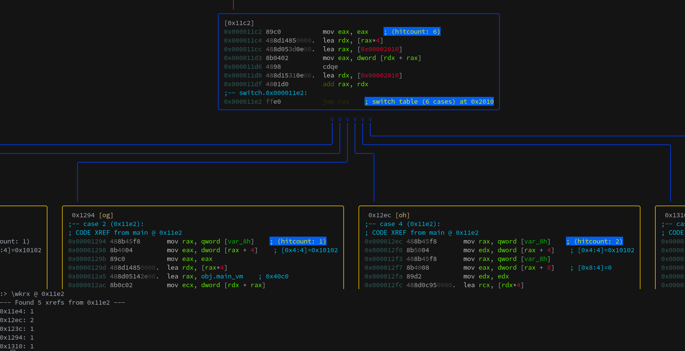

# r2wakare
r2wakare is a radare2 plugin able to load trace databases generated by wakare-converter.

## Installation
You will need to go into the ```plugins/r2wakare``` folder of this repository and
build the plugin. To build and install the plugin you just need to type:

```
$ r2pm -r make && r2pm -r make install 
```

## Features
- Basic block listing
- Basic block hitcount comments (hard to do bb highlighting in cli)
- Basic block diffing (Difference / Intersection)
- Branch target resolution (\wkrx)
- Supports PIE executables/traces

## Requirements
- make
- r2pm
- sqlite3

## Usage

```
[0x00001040]> \wkr
Wakare plugin:
\wkro [file]  : Open a trace database
\wkri         : Displays information about the loaded database
\wkrx         : Displays the xrefs from the current address
\wkrbl        : Displays the list of basic blocks
\wkrbh        : Adds hitcounts in basic blocks comments
\wkrbc        : Cleans the hitcount comments
\wkrdd [file] : Does a difference based diffing with another trace
\wkrdi [file] : Does an intersection based diffing with another trace
\wkrdr        : Resets the database to its original state
```

## Screenshot

